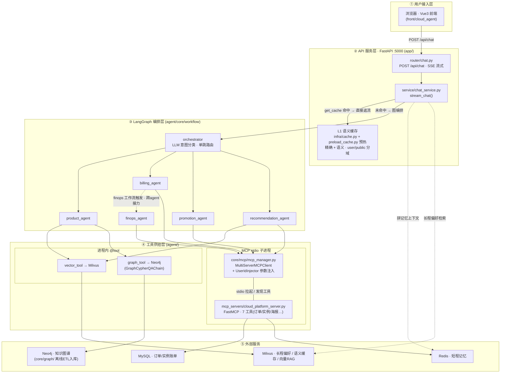
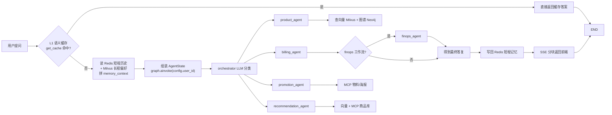

# CloudAgent · 云平台智能客服

基于 LangGraph 的多智能体客服系统。**Orchestrator-Worker（星型路由）拓扑**：一个 orchestrator 用 LLM 做单步意图分类，将请求路由到 5 个专业 Agent，覆盖产品咨询、账单、促销与推荐场景。

技术栈：Python · LangGraph · MCP · DashScope(Qwen) · Milvus · Neo4j · Redis · MySQL · FastAPI · Vue 3

---

## 一、架构

### 1.1 分层架构



### 1.2 单次请求运行时流程



---

## 二、设计要点

### 1. 单步路由，而非多步规划

orchestrator 只做一次 LLM 分类就交给下游 Agent，不做多轮规划。这是**客服场景的合理选择**：用户问题通常是单意图的，多步规划带来的延迟和不确定性大于收益。

代价是状态极简 —— `AgentState` 只有 7 个字段（对比 Pipeline 模式需要的 40+）。**状态复杂度由拓扑决定，不是设计冗余。**

### 2. MCP 协议落地

工具来自两个来源，刻意做了对比：

| 来源 | 实现 | 适用 |
|---|---|---|
| 进程内 `@tool` | `tools/vector_tool.py`、`tools/graph_tool.py` | 与主进程共享依赖、低延迟 |
| **MCP stdio 子进程** | `mcp_servers/cloud_platform_server.py`（FastMCP，7 个工具） | 语言无关、进程隔离、可独立部署 |

MCP 侧通过 `MultiServerMCPClient` 拉起子进程并**动态发现工具**，无需在主进程里硬编码工具清单。

### 3. UserIdInjector：服务端参数注入

`agent/agents/billing_agent.py` 中的 `UserIdInjector` 拦截 MCP 工具调用，在服务端把 `user_id` 注入参数，而不是让 LLM 生成它。

这解决的是一个真实风险：**如果 user_id 由模型填，用户可以通过提示注入让模型查询别人的订单。** 把身份参数移出模型的输出空间，是 Agent 系统里典型的权限边界设计。

### 4. RAG + GraphRAG 双路召回

`product_agent` 同时持有向量检索（Milvus）和知识图谱（Neo4j，走 `GraphCypherQAChain`）两个工具。向量召回擅长语义近邻，图谱擅长结构化关系，两者互补。图谱数据由 `core/graph/` 的离线 ETL 流程入库。

### 5. L1 语义缓存

`app/infra/cache.py` 实现两级命中：

1. **精确匹配**：归一化后的问句直接查 `question_norm` 字段
2. **语义匹配**：向量检索 + 距离阈值，命中近似问句

并按 `scope` 分域（`public` 公共知识 / `user` 用户私有），避免跨用户串数据。

### 6. 双层记忆

- **短期**：Redis，按会话存对话历史（`REDIS_TTL` 控制过期）
- **长期**：Milvus 存用户偏好，由 `preference_extractor.py` 从对话中抽取后写入

### 7. 无 Checkpointer（有意为之）

单轮客服场景不需要长任务恢复，因此不引入 Checkpointer。这是拓扑决定的设计取舍，不是遗漏。

---

## 三、快速开始

### 环境要求

Python 3.10+、Node.js 20.19+（或 22.12+，见 `front/cloud_agent/package.json` 的 `engines`）。需要 DashScope API Key（必填），以及 4 个外部服务：**Redis、Milvus、Neo4j、MySQL**。

### 后端（FastAPI · 端口 5000）

```bash
# 安装依赖（CLI 与 API 共用同一份 requirements）
pip install -r agent/requirements.txt

# 配置
cp agent/.env.example agent/.env
# 编辑 agent/.env，填写 DASHSCOPE_API_KEY 与各服务连接信息
# 注意：app/ 与 agent/ 读取的是同一个 agent/.env

# 初始化 MySQL 示例数据
mysql -u root -p < agent/database/init_mock_data.sql

# 启动
python agent/main.py                    # CLI 交互模式
python agent/main.py --query "什么是VPC"  # 单次查询
python app/app_main.py                  # API 服务模式，:5000
```

### 前端（Vite）

```bash
cd front/cloud_agent
npm install
npm run dev
```

### 知识图谱 / 向量库初始化（一次性）

以下三个脚本都可用相对路径从仓库根目录直接执行（内部路径由 `__file__` 推导，不依赖工作目录）。

```bash
python agent/test/build_kg.py                 # 建 Neo4j 知识图谱（默认读 mock_data/ecs_product_info.md）
python agent/test/build_kg.py <path/to/doc.md>  # 也可指定其他文档，输出同名 .json

python agent/test/milvus_rag.py --ingest      # 灌 Milvus 产品文档向量（读 mock_data/）
python agent/test/milvus_rag.py --query "退款规则"  # 不带 --ingest 时只做一次检索自检

python app/preload_cache.py                   # 预热 L1 语义缓存
```

---

## 四、目录结构

```
agent/                          # CLI 与 Agent 主体
├── core/workflow/
│   ├── graph_manager.py        # LangGraph 构建 + 条件路由
│   └── state.py                # AgentState（7 字段）
├── agents/
│   ├── orchestrator.py         # LLM 意图分类路由
│   ├── billing_agent.py        # MCP 客户端 + UserIdInjector 拦截器
│   └── product_agent.py        # 向量 RAG + 知识图谱
├── mcp_servers/
│   └── cloud_platform_server.py  # FastMCP stdio 服务，7 个工具
├── core/mcp/mcp_manager.py     # MCP 连接生命周期与工具发现
├── core/memory/                # 短期(Redis) + 长期(Milvus)
├── core/graph/                 # Neo4j 离线 ETL（models/client/parser/ingestor）
├── tools/                      # 进程内 @tool
└── test/                       # 一次性初始化脚本（非单元测试，见已知限制）

app/                            # FastAPI 服务层
├── router/chat.py              # SSE 流式接口
├── service/chat_service.py     # 缓存查询 → 图编排 → 记忆写回
├── infra/cache.py              # L1 语义缓存
└── preload_cache.py            # 缓存预热

front/cloud_agent/              # Vue 3 前端
mock_data/                      # RAG 用的产品/账单/工单示例文档
```

---

## 五、已知限制

- **L1 语义缓存目前只读不写**。`set_cache()` 仅在 `app/preload_cache.py` 预热时被调用，运行时链路上没有写回，因此缓存库中只有预置的少数问答，实际命中率很低。
- **语义缓存的阈值与度量可能不匹配**。`infra/cache.py` 中阈值常量为 `0.08`，而 Milvus 索引使用 `COSINE` 度量（返回的是相似度，越大越相似）。语义命中路径的实际生效范围待验证。
- **`agent/test/` 不是单元测试**。其中 `build_kg.py`、`milvus_rag.py` 等是一次性初始化脚本，目录命名有误导性；项目没有自动化测试。
- **强依赖 4 个外部服务**。Redis / Milvus / Neo4j / MySQL 任一缺失都会导致对应能力不可用，且没有降级路径。
- **业务数据为示例数据**。`mock_data/` 与 `agent/database/init_mock_data.sql` 为演示用构造数据，非真实业务。
