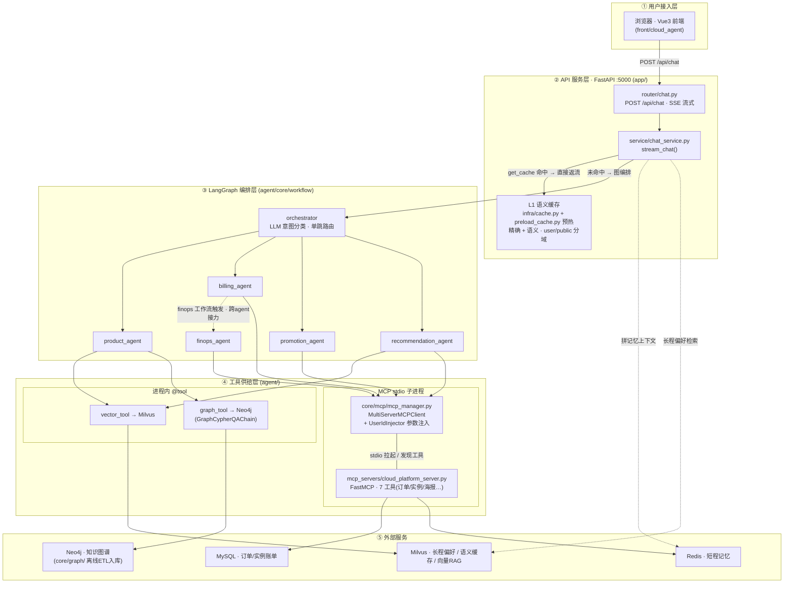
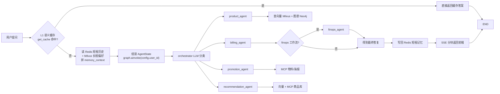

# CloudAgent · 云平台智能客服

基于 LangGraph 的多智能体客服系统。**Orchestrator-Worker（星型路由）拓扑**：一个 orchestrator 用 LLM 做单步意图分类，将请求路由到 5 个专业 Agent，覆盖产品咨询、账单、促销与推荐场景。

技术栈：Python · LangGraph · MCP · DashScope(Qwen) · Milvus · Neo4j · Redis · MySQL · FastAPI · Vue 3

---

## 一、架构

### 1.1 分层架构



### 1.2 单次请求运行时流程



---

## 二、设计要点

### 1. 单步路由，而非多步规划

orchestrator 只做一次 LLM 分类就交给下游 Agent，不做多轮规划。这是**客服场景的合理选择**：用户问题通常是单意图的，多步规划带来的延迟和不确定性大于收益。

代价是状态极简 —— `AgentState` 只有 6 个字段（对比 Pipeline 模式需要的 39 个）。**状态复杂度由拓扑决定，不是设计冗余。**

### 2. MCP 协议落地

工具来自两个来源，刻意做了对比：

| 来源 | 实现 | 适用 |
|---|---|---|
| 进程内 `@tool` | `tools/vector_tool.py`、`tools/graph_tool.py` | 与主进程共享依赖、低延迟 |
| **MCP stdio 子进程** | `mcp_servers/cloud_platform_server.py`（FastMCP，7 个工具） | 语言无关、进程隔离、可独立部署 |

MCP 侧通过 `MultiServerMCPClient` 拉起子进程并**动态发现工具**，无需在主进程里硬编码工具清单。

### 3. UserIdInjector：服务端参数注入

`agent/agents/billing_agent.py` 中的 `UserIdInjector` 拦截 MCP 工具调用，在服务端把 `user_id` 注入参数，而不是让 LLM 生成它。

这解决的是一个真实风险：**如果 user_id 由模型填，用户可以通过提示注入让模型查询别人的订单。** 把身份参数移出模型的输出空间，是 Agent 系统里典型的权限边界设计。

### 4. RAG + GraphRAG 双路召回

`product_agent` 同时持有向量检索（Milvus）和知识图谱（Neo4j，走 `GraphCypherQAChain`）两个工具。向量召回擅长语义近邻，图谱擅长结构化关系，两者互补。图谱数据由 `core/graph/` 的离线 ETL 流程入库。

### 5. L1 语义缓存

`app/infra/cache.py` 实现两级命中：

1. **精确匹配**：归一化后的问句直接查 `question_norm` 字段
2. **语义匹配**：向量检索 + 相似度阈值（COSINE，阈值 0.85），命中近似问句

并按 `scope` 分域（`public` 公共知识 / `user` 用户私有），避免跨用户串数据。

**写入准入**（`chat_service._maybe_cache`）：推理完成后不是无条件回写，而是先过滤——答案非空且长度达标、不含错误标记、字段不超 Milvus 的字节上限；作用域按来源 Agent 判定，只有 `product_agent` 的纯产品回答进公共域，账单/推广/推荐的回答含用户私有数据（实例 ID、专属返佣链接），一律只写进该用户的私有域。

### 6. 双层记忆

- **短期**：Redis，按会话存对话历史（`REDIS_TTL` 控制过期）
- **长期**：Milvus 存用户偏好，由 `preference_extractor.py` 从对话中抽取后写入

### 7. 无 Checkpointer（有意为之）

单轮客服场景不需要长任务恢复，因此不引入 Checkpointer。这是拓扑决定的设计取舍，不是遗漏。

---

## 三、快速开始

### 环境要求

Python 3.10+、Node.js 20.19+（或 22.12+，见 `front/cloud_agent/package.json` 的 `engines`）。需要 DashScope API Key（必填），以及 4 个外部服务：**Redis、Milvus、Neo4j、MySQL**。

### 后端（FastAPI · 端口 5000）

```bash
# 安装依赖（CLI 与 API 共用同一份 requirements）
pip install -r agent/requirements.txt

# 配置
cp agent/.env.example agent/.env
# 编辑 agent/.env，填写 DASHSCOPE_API_KEY 与各服务连接信息
# 注意：app/ 与 agent/ 读取的是同一个 agent/.env

# 初始化 MySQL 示例数据
mysql -u root -p < agent/database/init_mock_data.sql

# 启动
python agent/main.py                    # CLI 交互模式
python agent/main.py --query "什么是VPC"  # 单次查询
python app/app_main.py                  # API 服务模式，:5000
```

### 前端（Vite）

```bash
cd front/cloud_agent
npm install
npm run dev
```

### 知识图谱 / 向量库初始化（一次性）

以下三个脚本都可用相对路径从仓库根目录直接执行（内部路径由 `__file__` 推导，不依赖工作目录）。

```bash
python agent/test/build_kg.py                 # 建 Neo4j 知识图谱（默认读 mock_data/ecs_product_info.md）
python agent/test/build_kg.py <path/to/doc.md>  # 也可指定其他文档，输出同名 .json

python agent/test/milvus_rag.py --ingest      # 灌 Milvus 产品文档向量（读 mock_data/）
python agent/test/milvus_rag.py --query "退款规则"  # 不带 --ingest 时只做一次检索自检

python app/preload_cache.py                   # 预热 L1 语义缓存
```

**Neo4j 需要 APOC 插件**：`graph_tool` 的 schema 反射依赖 `apoc.meta.data()`。社区版镜像不自带，需把对应版本的 `apoc-<version>-all.jar` 放进容器 `/plugins` 目录后重启。未安装时图谱查询会自动退化为关键词检索，功能可用但精度下降。

---

## 四、目录结构

```
agent/                          # CLI 与 Agent 主体
├── core/workflow/
│   ├── graph_manager.py        # LangGraph 构建 + 条件路由
│   └── state.py                # AgentState（6 字段）
├── agents/
│   ├── orchestrator.py         # LLM 意图分类路由
│   ├── billing_agent.py        # MCP 客户端 + UserIdInjector 拦截器
│   └── product_agent.py        # 向量 RAG + 知识图谱
├── mcp_servers/
│   └── cloud_platform_server.py  # FastMCP stdio 服务，7 个工具
├── core/mcp/mcp_manager.py     # MCP 连接生命周期与工具发现
├── core/memory/                # 短期(Redis) + 长期(Milvus)
├── core/graph/                 # Neo4j 离线 ETL（models/client/parser/ingestor）
├── tools/                      # 进程内 @tool
└── test/                       # 一次性初始化脚本（非单元测试，见已知限制）

app/                            # FastAPI 服务层
├── router/chat.py              # SSE 流式接口
├── service/chat_service.py     # 缓存查询 → 图编排 → 记忆写回
├── infra/cache.py              # L1 语义缓存
└── preload_cache.py            # 缓存预热

front/cloud_agent/              # Vue 3 前端
mock_data/                      # RAG 用的产品/账单/工单示例文档
```

---

## 五、评测

项目自带**四组评测 + 三个验证探针**。刻意不合成一个大指标——这个项目的卖点本来就是「多个约束机制各自成立」，每个机制单独证才有意义。

产物与逐条解读见 [`data/eval/results/README.md`](data/eval/results/README.md)。

| 组 | 脚本 | 结论 |
|---|---|---|
| ① 意图路由 | `run_routing_eval.py` | 计分集 40/40 = 100% |
| ② 图向量双路检索 | `run_hybrid_eval.py` + `judge_hybrid.py` | 向量 28/30、并集 30/30 |
| ③ 语义缓存延迟 | `measure_cache_latency.py` | 见 5.3 |
| ④⑤⑥⑦ 验证探针 | 四个独立脚本 | 见 5.4 |

### 5.1 意图路由：40 题计分集 100%，但边界 4 题全错

`routing_set.jsonl` 共 50 条，分三类：

- **scored 40**（产品 / 账单 / 推广 / 推荐 / FinOps 五类各 8 题，问法为无歧义表述）→ **40/40 = 100%**，单题延迟 0.3–0.8s（均值 0.4s）
- **chitchat 6** → 系统代码里**没有闲聊类**，统一兜底到 `product_agent`。不计入准确率：它测的是兜底行为，不是分类正确性
- **boundary 4** → **全部判错，且是设计层面的规则冲突**，逐条都有 `note` 记录原因

边界那 4 条保留在集合里单独归类，没有藏：它们暴露的是 prompt 规则本身重叠（「推荐型号」同时命中 recommendation 规则、「产品选型」命中 product 规则；另有一条 prompt 把「业务场景选规格」归 product、「推荐型号」归 recommendation）。要修得改 prompt，不是评测脚本能判对错的。**「100%」这个数附带着「问法无歧义」的前提，两个要一起报。**

### 5.2 图向量双路检索：报向量与并集，不报图谱

30 题（地域可用区 6 / 实例规格 9 / 存储 5 / 计费退款 7 / 网络安全 3）：

| | 第一次判分 | 第二次判分 |
|---|---|---|
| 向量路 | 28/30 (93.3%) | 28/30 (93.3%) |
| 图谱路 | 16/30 (53.3%) | 13/30 (43.3%) |
| **并集** | **30/30 (100%)** | **30/30 (100%)** |

图谱路独有补回 2 条（`s08`、`s12`），两次一致。

**为什么图谱单独命中率不给数**：LLM 生成的 Cypher 在 `temperature=0` 下仍有 **26/30 条跨次不同**，Cypher 一变图谱侧判分就抖（16 vs 13）。**只有向量路的 28/30 和并集的 30/30 在两次判分中完全一致**，所以只报这两个。这不是「多跑几次取平均」能解决的——要报得先让 Cypher 稳定。

另有一层必须说清：**两路同源**——都建在同一份 `mock_data/` 文档上，图谱是有损抽取，独有补回只有 2 条。所以「并集 100%」的含义是「双路互补消除了单路盲区」，不能读成「图谱贡献了一半」。

判分口径演进过一次：最初用字符串匹配判「参考答案裸值是否出现在检索原文里」，对散文式回答与结构化裸值无法同时适配（必须含 `cn-hangzhou`，散文写「杭州地域」就判不中），后改为 LLM 判官。旧口径产物 `hybrid_runs.jsonl` 保留留痕，数字不作数。

### 5.3 语义缓存延迟

缓存是**两级判定**：先 `question_norm` 标量精确匹配（不调 embedding），未命中再走向量检索。

| 场景 | 首字延迟 |
|---|---|
| 精确命中（纯 Milvus 标量，无 embedding 往返） | 11.4 / 12.1 / 13.8 ms |
| 语义命中（含一次 embedding 往返） | 460.2 / 353.9 / 335.0 ms |
| HTTP 端到端首字（精确命中） | 94.9 / 22.8 / 25.2 ms |
| **冷启动对照**（不透缓存，走完整 Agent 推理） | **11306 / 11316 / 11442 ms** |

阈值 0.85 的取法：实测四个点卡在中间——同一问句 1.0、同义改写 0.87、同主题不同问题 0.47、无关问题 0.07，恰好落在「同义改写」与「同主题不同问题」之间。

### 5.4 验证探针

机制类结论用独立小脚本证，不靠「跑一遍看着对」：

| 探针 | 脚本 | 结论 |
|---|---|---|
| 长期记忆写路径 | `verify_ltmem_write.py` | 抽取 6 条偏好 → 去重落 Milvus 6 行 → 回读 3 条 |
| 跨用户隔离 | `verify_ltmem_isolation.py` | 本人检索 2 条；拿他人 `user_id` 注入取值检索 **0 条** |
| 过滤表达式注入 | `probe_filter_injection.py` | 未转义 payload 命中全表 12 行；**转义后 0 行** |
| 未接线代码扫描 | `scan_dead_wiring.py` | 定义 85 个 / 零调用 18 个 / 可疑 2 个 |
| 存储探针 | `probe_stores.py` | 列出 7 个 collection 的行数与字段 schema |

### 5.5 两点诚实说明

1. **`probe_filter_injection` 的 `long_term_memory` 那一栏是空的、无效的。** 四行全 0，因为跑探针时该集合整体就是 0 行（当时长期记忆写路径还是死的）。它**证不了**注入是否被挡住，真正有判别力的是 `qa_semantic_cache` 那一栏（12 → 0）。
2. **`scan_dead_wiring` 的「零调用点」混着 MCP 工具。** `query_user_orders`、`search_product_catalog` 这类由 MCP 客户端按名字经 stdio 调用，静态分析看不见调用点，**不是可删的死代码**。

---

## 六、已知限制

- **缓存无淘汰策略**。运行时写回只做准入过滤（长度、异常标记、字段字节上限），没有 TTL 或 LRU，长跑下去集合会持续增长。
- **缓存准入只校验 query 的字节上限，不校验 query 是否自成一句。** dump 时见到一条 `question_norm = '我觉得不够'` 的多轮片段以公共域身份入库。严重度低——`PUBLIC_SCOPE_AGENTS = {"product_agent"}`（`app/service/chat_service.py:49`）只放产品咨询进公共域，而 product 的回答都是公开产品信息，不涉及私有数据。**已决定不修，当已知限制讲。**
- **`agent/test/` 不是单元测试**。其中 `build_kg.py`、`milvus_rag.py` 等是一次性初始化脚本，目录命名有误导性；项目没有自动化测试。
- **强依赖 4 个外部服务**。Redis / Milvus / Neo4j / MySQL 任一缺失都会导致对应能力不可用。知识图谱工具有关键词降级路径（不依赖 APOC），其余能力无降级。
- **业务数据为示例数据**。`mock_data/` 与 `agent/database/init_mock_data.sql` 为演示用构造数据，非真实业务。
